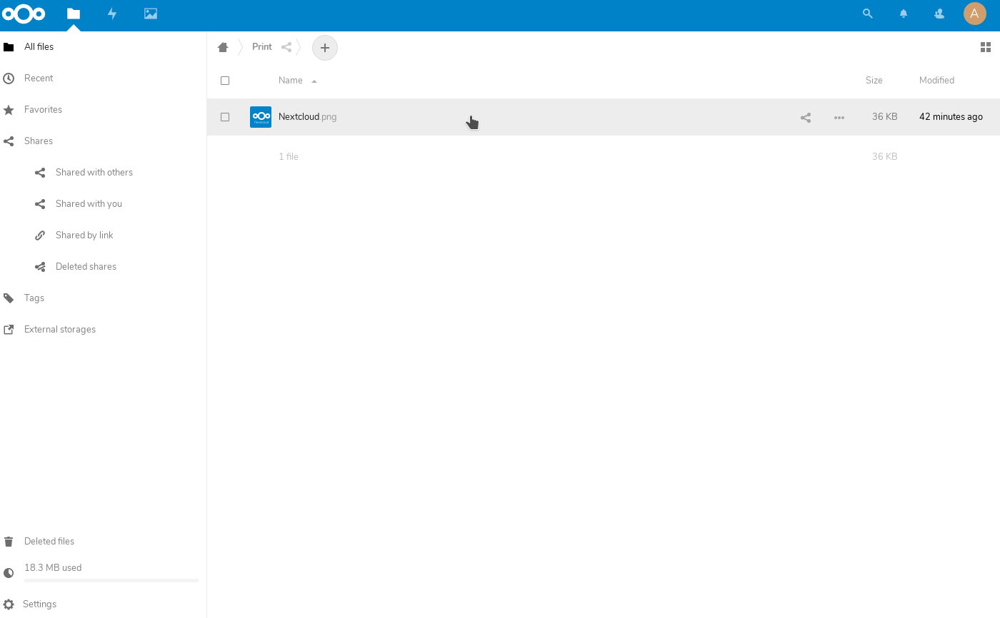

Checksum
========

**App for [Nextcloud](https://nextcloud.com) to print files using the CUPS/LPR printing ecosystem.**

Installation
------------

**Nextcloud**

You need a working CUPS setup with a compatible printer set up as the default printer and the LPR daemon installed on your server.

On Debian, you can install the packages `cups` and `cups-bsd` and configure a default printer in CUPS (please refer to the CUPS documentation on how to do that). You can verify the installation with `lpstat -p` and `lpstat -d` after you configured CUPS correctly.

To install the app itself on your instance, simply navigate to »Apps« in your Nextcloud web interface, choose the category »Tools«, find the Printer app and enable it.

Usage
-----

Just open the details view of the file (Sidebar). There should be a new tab called "Printer". Select the orientation the file you want to print and it will try to execute the LPR (Line Printing Daemon) command on the CLI to send the job to a printer configured in CUPS. Currently, only the printer set as default can be used for printing.

Possible orientations are "Landscape" and "Portrait". Further options will be added in the future.

Compatibility and limitations
-------------

- I only tested the app for the current versions of Nextcloud (14 and up).
- I tried to use the current api as much as possible. It should be safe for future versions.
- Currently only files supported by CUPS natively are supported for printing. This includes Images, PDFs, text files and probably others. Not all filetypes are supported by CUPS.
- The app currently misses a lot of features that will be added in future versions of the app. If you want to help out with development, a PR is highly welcome.
